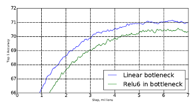
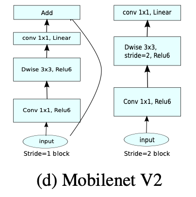

# MobileNetV2: Inverted Residuals and Linear Bottlenecks

이정수

### [[2018 IEEE/CVF Conference on Computer Vision and Pattern Recognition](CVPR)](https://arxiv.org/pdf/1801.04381.pdf)

- ### **Abstract**

  - MobileNet V1의 cnn구조를 약간 수정하여**(Inverted residual)** 파라미터 수와 연산량을 보다 줄이는데 성공
  - 그 결과, 다른 도메인에서(detection, segmentation) 해당 네트워크를 backbone으로 사용한 모델들의 성능이 더 높게 나온것을 확인

- ### **Linear Bottlenecks**

  - 고차원 공간의 정보를 저차원 공간에 Mapping하여도 큰 데이터 손실이 없다는 **Manifold 가설** 에 따라 본 논문에서는 1x1 Pointwise Convolution을 사용해 차원을 축소. 일반적으로 신경망 내부에는 고차원 데이터(low data)들이 저차원 데이터(extracted feature)로 압축되는 encoder가 생김. 이렇게 데이터가 저차원의 subspace로 mapping되는 현상이 manifold.

  - 본 논문에서는 Relu를 사용함에 있어서 0 이상의 부분만 선형 변환을 진행하기 때문에 필연적으로 정보 손실이 있으나, channel이 충분히 많다면 Relu를 사용해도 중요한 정보들은 보존된다고 주장(input manifold가 low-dimension에 존재할 때)

    

    

  - 이렇게 저차원으로 mapping하는 연산을 할 때, Relu는 단순히 값을 선형 전파(Linear Transform)하기 때문에 manifold 정보를 그대로 유지한다고 볼 수 있으며, 이렇게 **선형 전파를 통해 차원은 축소하고 정보는 유지**하는 layer를 만들어 적용하고자 함

    

- ### Inverted Residuals

  - MobileNet V1에서 사용하던 Depthwise Separable Convolution과 Linear Bottlenecks을 결합한 형태
  - 기존의 Residuals가 큰 Input channel을 압축하여 Convolution을 적용한것과 반대로, 작은 Input channel을 Pointwise 연산으로 **확장(Invert)**하고, Depthwise 연산을 진행. 이는 위의 설명대로, 충분한 channel에서 Relu 연산을 진행해야 데이터 손실을 방지할 수 있기 때문. 이후 Depthwise 연산으로 다시 channel을 축소

  

  

  - Mobilenet V2에는 두가지 block이 있는데, 첫번째는 stride가 1인 residual block이고, 두번째는 stride가 2인 downsizing block으로, 두 block 모두 3개의 layer로 구성.

    - 첫번째 layer는 Pointwise convolution + ReLU6 로 구성됨. 이때 ReLU6는 

      min(max(x, 0), 6) 의 식을 따르며, 6이상의 값은 6으로 수렴하는 ReLU 연산임. 이는 학습이나 최적화 관점에서 더 좋은 것으로 확인

      출처 : [ReLU6를 사용하는 이유](https://gaussian37.github.io/dl-concept-relu6/)

    - 두번째 layer는 Depthwise convolution + ReLU6 로 구성됨. 이때 첫번째 block은 stride가 1이고, 두번째 block은 stride가 2로 적용되어 downsizing 됨

    - 세번째 layer는 다시 Pointwise convolution 연산을 진행하는데, 이때 Activation Funtion은 사용하지 않음. 논문에서는 과도한 non-linearity가 데이터를 손상시킨다고 주장

      

      

    - stride=1인 첫번째 block만 skip connection을 사용해 첫번째 layer와 Add하고, stride=2인 block에는 skip connection을 사용하지 않음. 이는 downsizing으로 인해 skip connection 또한 크기를 맞춰줘야 하는 문제로 인해 사용하지 않는것으로 추정

      

      

    

  - 기존 residuals와 다르게 narrow한 input을 가지고 있지만, 필요한 정보는 저차원에 있다는 가정 하에 skip connection을 진행하여 memory efficiency한 연산이 가능함

  

- ### Result

  - 기존 Mobilenet V1, ShuffleNet에 비해 적은 파라미터와 MAdds, 빠른 연산속도를 보임. 이외에도 Object Detection, Segmentation의 분야에서도 뛰어난 성능을 보임

